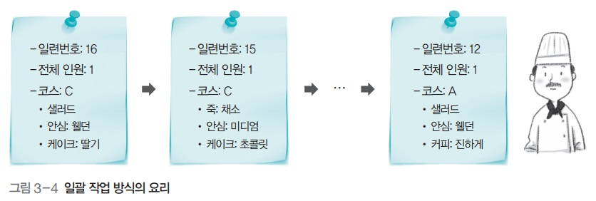

# 운영체제 - 프로세스

프로세스
<!--more-->
# 프로세스

# 1. 프로세스

## 프로그램

- 저장장치에 저장되어 있는 정적인 상태

## 프로세스

- 실행을 위해 메모리에 올라온 동적인 상태

# 2. 작업 방식

## 일괄 작업 방식

- 레스토랑에 테이블이 하나만 있는 것
- 큐를 사용 해 주문서를 받은 순서대로 요리
- 한 손님의 식사가 끝나야 다음 손님을 받을 수 있음
    - 효율이 떨어짐

## 시분할 방식

- 요리사 한명이 시간을 적절히 배분해 여러 요리를 동시에 함
- 주문 목록에 있는 주문서 중 하나를 가져다가 요리
- 모든 요리가 제공되면 주문 목록에서 삭제

## 시분할 방식에서의 상황 처리

# 3. 프로세스 제어 블록 (.)

## 개념

- 운영체제가 해당 프로세스를 위해 관리하는 자료 구조

## 포함 내용

- 프로세스 구분자: 각 프로세스를 구분하는 구분자
- 메모리 관련 정보: 프로세스의 메모리 위치 정보
- 각종 중간값: 프로세스가 사용했던 중간값

# 4. 프로세스와 프로그램의 관계

- **프로그램이 프로세스가 된다는 것**
    - 운영체제로부터 프로세스 제어 블록을 얻는다는 것
- **프로세스가 종료된다는 것**
    - 해당 프로세스 제어 블록이 폐기된다는 것

# 5. 프로세스의 네 가지 상태

- **생성 상태**
    - 프로세스가 메모리에 올라와 실행 준비를 완료
    - 프로세스 제어 블록을 할당받음
- **준비 상태**
    - 생성된 프로세스가 CPU를 얻을 때 까지 기다리는 상태
- **실행 상태**
    - 준비 상태에 있던 프로세스 중 하나가 CPU를 얻어 실제 작업을 수행 중
- **완료 상태**
    - 실행 상태의 프로세스가 주어진 시간 동안 작업을 마침
    - 프로세스 제어 블록 폐기

- **디스패치**
    - 준비 상태의 프로세스 중 하나를 골라 실행 상태로 바꾸는 CPU 스케줄러의 작업
- **타임아웃**
    - 프로세스가 자신에게 주어진 하나의 타임 슬라이스 동안 작업을 끝내지 못하면 다시 준비 상태로 돌아감

# 6. 프로세스의 다섯 가지 상태

- 생성 상태
- **준비 상태**
    - 프로세서 제어 블록은 준비 큐에서 기다리며 CPU 스케줄러에 의해 관리
    - CPU 스케줄러는 준비 상태에서 큐를 몇개 운영할지, 어떤 프로세스의 프로세서 제어 블록을 디스패치 할지 결정
- **실행 상태**
    - 실제 CPU를 얻어 실행중
    - 주어진 시간, 즉 타임 슬라이스 동안만 작업 가능
    - 타임 슬라이스를 다 사용하면 타임아웃
    - 실행 상태 동안 작업이 완료되면 **exit**(.)가 실행되어 프로세스 종료
    - 실행 상태 중 I/O가 요청되면 CPU는 입출력 관리자에게 입출력을 요청하고 **block**(.) 실행
    - 해당 프로세스가 대기 상태로 옮긴 후 CPU 스케줄러는 새로운 프로세스를 디스패치
- **대기 상태**
    - 대기 상태의 프로세스는 입출력장치별로 마련된 큐에서 기다림
    - 입출력이 완료되면 인터럽트 발생, 해당 인터럽트로 깨어날 프로세스를 찾는 **wakeup**(.) 발생
- **완료 상태**
    - 프로세스가 종료되는 상태
    - 코드와 사용했던 데이터를 메모리에서 삭제
    - 프로세스 제어 블록 폐기
    - 오류 등 비정상적인 종료가 일어나면 디버깅을 위해 **코어 덤프** 실행

- 디스패치
- 타임아웃
- **블럭**
    - 입출력이 완료될 때 까지 작업을 진행할 수 없기에 해당 프로세스를 대기상태로 옮기는 작업
- **웨이크업**
    - 입출력이 완료되어 인터럽트가 발생하면, 해당 인터럽트로 깨어날 프로세스를 찾아 그 프로세스의 제어 블록을 **준비 상태**로 이동
- **코어 덤프**
    - 종료 직전의 메모리 상태를 저장장치로 옮기는 것

## 요약

# 7. 기타 상태들

## 휴식 상태

- 유닉스 계열에서 프로그램을 실행하는 동안 Ctrl+Z를 누르면 볼 수 있음
- 프로세스가 작업을 일시적으로 쉬고 있는 상태
- 종료 상태가 아니기 때문에 원할 때 다시 시작할 수 있음

## 보류 상태

- 프로세스가 메모리에서 잠시 쫓겨난 상태
    - 메모리가 꽉 차서
    - 프로그램에 오류가 있어서 실행을 미루어야 할 때
    - 바이러스와 같이 악의적인 프로세스라고 판단
    - 매우 긴 주기로 반복되는 프로세스라서
    - 입출력이 너무 지연될 때

- **보류-준비 상태**
    - 준비상태에서 보류되었으면 이쪽으로
- **보류-대기 상태**
    - 대기상태에서 보류되었거나
    - 보류-대기 상태에서 입출력이 완료되어 인터럽트가 일어났다면 이쪽으로
