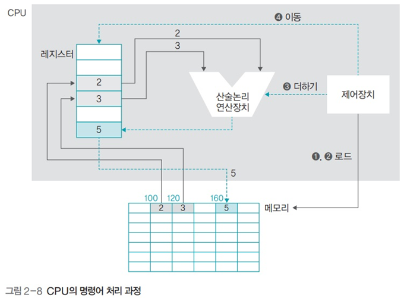

# 운영체제 - 하드웨어의 구성

하드웨어의 구성
<!--more-->
# 하드웨어의 구성

# 1. 하드웨어의 구성

## CPU

- 명령어를 처리

## RAM

- 작업에 필요한 프로그램과 데이터를 저장하는 장소
- 바이트 단위로 분할되어 있으며 분할 공간마다 주소로 구분

## 입출력장치

## 저장장치

## 메인보드

- 다양한 장치들을 bus로 연결한다

# 2. 폰 노이만 구조

- CPU, 메모리, 입출력장치, 저장장치가 버스로 연결되어 있는 구조
- 프로그램은 하드디스크 등의 저장장치에 저장
- **하드디스크에서 프로그램을 직접 실행할 수 없고 메모리로 가져와야 실행 가능**
- 그러므로 메인 메모리의 관리가 중요한 포인트
- 메모리가 작을수록 동시에 실행할 수 있는 프로그램이 적어지므로 컴퓨터가 느려진다

# 3. 하드웨어 사양 관련 용어

## 클럭

- 일정 간격으로 tick을 만들어 CPU 구성요소들이 이에 맞춰 작업
- 클록틱, 펄스라고도 함

## 헤르츠

- 클록틱이 발생하는 속도를 나타내는 단위
- 1초에 1000번이면 1000Hz (1kHz)

## 시스템 버스

- 메모리와 주변 장치를 연결하는 버스, FSB *Front Side Bus* 라고 함

## CPU 내부 버스

- CPU 내부에 있는 장치들을 연결하는 버스. BSB *Back Side Bus* 라고 함

## CPU와 메모리의 속도

- CPU는 CPU 내부 버스의 속도로 작동하고 메모리는 시스템 버스의 속도로 작동
- 일반적으로 CPU 내부 버스의 속도가 더 빠르다
- 두 버스의 속도 차이로 인해 작업이 지연되며, 이 문제를 Cache로 해결

# 4. CPU의 구성과 동작

## 산술논리 연산장치 (ALU)

- AND, OR과 같은 논리연산과 덧셈, 뺄셈같은 산술 연산을 수행

## 제어장치

- CPU에서 작업을 지시

## 레지스터

- CPU 내에 데이터를 임시로 보관

# 5. CPU의 명령어 처리 과정

- 고급 언어로 스크립트를 짜서 컴파일하면 저수준 언어인 어셈블리어로 변환
- CPU는 어셈블리어를 해석해 명령어 수행

## 프로그램 상태 레지스터의 역할

- 연산 결과가 음수인지 아닌지, 0이 아닌지, 자리 올림이 있는지 등의 프로그램의 상태를 저장

- D2-D3의 결과를 임시로 저장하고 있다가 해당 상태를 제어장치에 알려주어 다음에 몇번 행으로 이동할지를 결정

# 6. 버스의 종류 💥

> 버스의 종류와 특징, 양방향인지 단방향인지 외워둘 것

## 버스의 대역폭

- 한번에 전달 가능한 데이터의 최대 크기
- CPU가 한 번에 처리할 수 있는 데이터의 크기와 같다
- CPU가 한 번에 처리할 수 있는 최대 데이터의 크기를 word라고 부름
- **32bit CPU**는 메모리에서 **데이터를 읽거나 쓸 때 한번에 최대 32bit**를 처리할 수 있음. 이 경우 **레지스터의 크기**도 **32bit**, **버스의 대역폭**도 **32bit**.
- **버스의 대역폭, 레지스터의 크기, 메모리에 한 번에 저장할 수 있는 데이터의 크기는 동일**

# 7. 메모리의 종류

## 휘발성 메모리

- **DRAM**
    - 저장된 0과 1의 데이터가 시간이 지나면 사라지므로 일정 시간마다 다시 재생시켜야 한다
- **SRAM**
    - 전력이 공급되는 동안에는 데이터를 보관할 수 있어 재생할 필요 없음
- **SDRAM**
    - 클록틱이 발생할 때 데이터를 저장하는 동기 DRAM

## 비휘발성 메모리

- 플래시 메모리
- SSD

## 롬의 종류

- 마스크 롬
    - 데이터를 지우거나 쓸 수 없음
- PROM
    - 전용 기게를 이용해 데이터를 한 번만 저장할 수 있음
- EPROM
    - 데이터를 여러 번 쓰고 지울 수 있음

# 8. 메모리 보호의 필요성

- 현대 운영체제는 시분할 기법을 사용해 여러 프로그램을 동시에 실행
- 메모리를 보호하지 않으면 어떤 작업이 다른 작업의 영역을 침범해 크래시를 일으킬 수 있음

**즉, 프로그램 작업영역을 한정해두고 이를 벗어나는 행동이 일어나면 운영체제가 프로그램을 강제 중단한다는 것.**

# 9. 부팅

- 컴퓨터를 켰을 때 운영체제를 메모리에 올리는 과정
- Bootstraping의 약자

- 마스터 부트 레코드에 있는 부트스크랩 코드를 올려서 실행
    - 부트스트랩 코드는 하드디스크에 있는 운영체제 프로그램을 실행

# 10. 버퍼

## 버퍼

- 속도에 차이가 있는 두 장치에서 그 차이를 완화하는 역할을 함
- 두 장치 사이에서 일정량의 데이터를 모아서 옮겨 속도의 차이를 완화
- 예를들어 A장치가 빠르고 B장치가 느리다면, A장치는 B장치가 다른 작업을 하는 동안 버퍼에 데이터를 넘기고 자신도 다른 작업을 할 수 있다.

## 스풀

- CPU와 입출력장치가 독립적으로 동작하도록 고안된 소프트웨어적인 버퍼
- 예시) 프린터 스풀
    - 스풀이 없다면 예를들어 워드에서 프린팅을 할 경우 프린팅이 완료될 때 까지 워드 프로그램은 프리징 상태가 되어버릴 것이다.

## 캐시

- 메모리와 CPU간의 속도 차이 (BSB, FSB 사이의) 를 완화하기 위해 메모리의 데이터를 미리 가져와 저장
- CPU가 앞으로 사용할 것으로 예상되는 데이터를 미리 가져다놓음
- CPU는 메모리에 접근해야 할 때 캐시를 먼저 방문해 원하는 데이터가 있는지 찾아봄

## 캐시의 구조

- **캐시 히트**
    - 캐시에서 원하는 데이터를 찾는 것
- **캐시 미스**
    - 원하는 데이터가 캐시에 없으면 메모리로 가서 데이터를 찾음
- **캐시 적중률**
    - 캐시 히트가 되는 비율
    - 일반적인 캐시 적중률은 약 90%

    

## 캐시 적용 예

- L1 캐시만 사용 가정
- 캐시 접근 시간 = 10
- 메모리 접근 시간 = 100
- 캐시 적중률 = 80%
    - 즉 캐시를 80% 사용하고 나머지 20% 경우에만 메모리에서 가져온다는 뜻
- 메모리만 사용하는 경우 평균 접근시간 = 100
- 캐시 사용시 평균 접근시간 = 30

$$(0.8\times10)+(0.2\times100) = 28$$

## 캐시의 쓰기 방식

### 즉시 쓰기

- 캐시에 있는 데이터가 변경되면 이를 메모리에 즉시 반영하는 방식
- 메모리와의 빈번한 전송으로 성능이 느려짐
- 메모리의 최신 값이 항상 유지. 갑작스러운 정전에도 데이터를 잃어버리지 않음

### 지연 쓰기

- 실시간으로 변경하지 않고, 캐시에서 변경된 내용을 주기적으로 확인해 메모리에 반영
- 카피백 이라고도 함
- 메모리와 데이터 전송 횟수가 줄어들어 시스템의 성능 향상
- 메모리와 캐시된 데이터 사이의 불일치가 발생할 수 있음

## L1 캐시와 L2 캐시

### 일반 캐시

- 명령어와 데이터의 구분 없이 모든 자료를 가져옴
- 메모리와 연결되기 때문에 L2 (Level 2) 캐시라고 부름

### 특수 캐시

- 명령어와 데이터를 구분하여 가져옴
- CPU 레지스터에 직접 연결되기 때문에 L1 (Level 1) 캐시라고 부름

# 11. 저장장치의 계층 구조

## 개념

- 속도가 빠르고 값이 비싼 저장장치를 CPU 가까운 쪽에
- 싸고 용량이 큰 저장장치를 반대쪽에 배치하여
- 빠른 속도와 큰 용량을 적절한 가격으로 얻는 것

## 장점

- CPU와 가까운 쪽에 레지스터나 캐시를 배치해 작업이 빨리 이루어지도록 함
- 메모리에서 작업한 내용을 하드디스크같이 저렴하고 용량이 큰 저장장치에 영구적으로 저장

